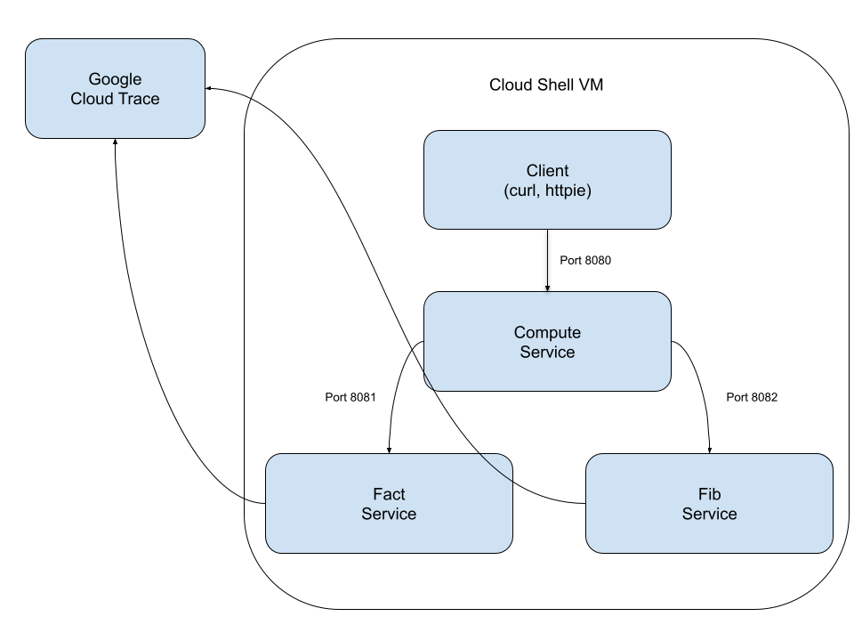

# Distributed Tracing Sample Using Cloud Run and Cloud Trace
This is a sample app for demonstrating how to use Google Cloud Trace for distributed tracing for apps deployed on Google Cloud Run

# Sources
The microservices in here are not original -- they are derivatives of what was shared in 
[this blog post](http://www.vinsguru.com/spring-boot-distributed-tracing-with-jaeger/).  I simply modified the 
microservices for Cloud Run deployment and integration with Cloud Trace.  I also previously did this 
[same exercise using Cloud Foundry.](https://github.com/bthelen/jaeger-tracing-sample)

# Assumptions

This sample assumes you have a Google Cloud account and project setup with Cloud Trace and Cloud Run
APIs enabled.  It also assumes you are able to create Cloud Run services with no authentication required.

# Test in Cloud Shell
Note that we are testing this in Cloud Shell because we can use an application default
credential that will be used by the Spring Cloud GCP trace SpringBoot starter.

> This practice is not acceptable for production -- please don't take this  repo as an
> endorsement for this practice, it's for development purposes only!  The proper practice
> for production is outlined below where we run on Cloud Run with a user manged Service Account
> that has least privilege applied.

## Architecture Overview



## Setup Application Default Credential

In Cloud Shell, run the following command to allow the applications you will run use the 
account that you are currently logged in with.

```bash
# Respond with Yes if prompted
$ gcloud auth application-default login
```

## Checkout Source If You Haven't Already

```bash
$ git clone <put url here when we have one>
```

## Run Apps

```bash
# change to correct directory if not already there
$ cd cloud-trace-sample
# In each of the directories compute-service, fib-service, and fact-service
$ mvn spring-boot:run

```

## Test app by generating some traffic

```bash
$ for i in 1 2 3 4 5 6 7 8 9 10 11 12; do curl -k http://localhost:8080/api/compute/fib/$i; done
$ for i in 1 2 3 4 5 6 7 8 9 10 11 12; do curl -k http://localhost:8080/api/compute/fact/$i; done
```

# Deploy to Cloud Run
